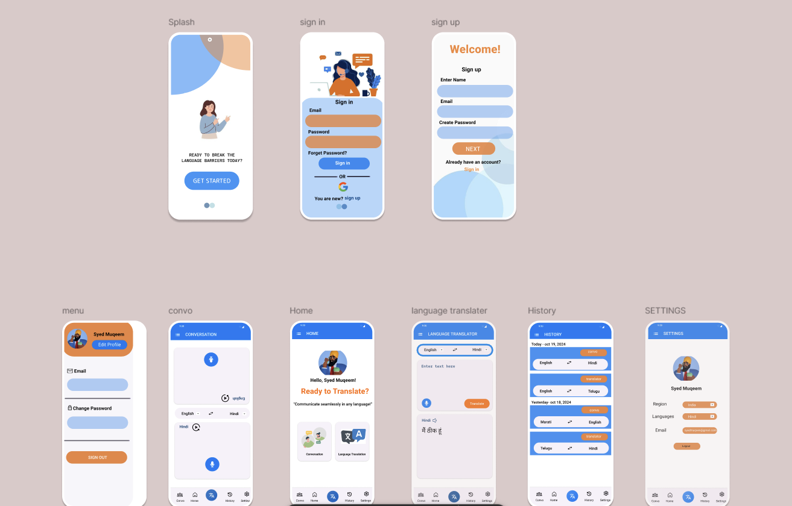
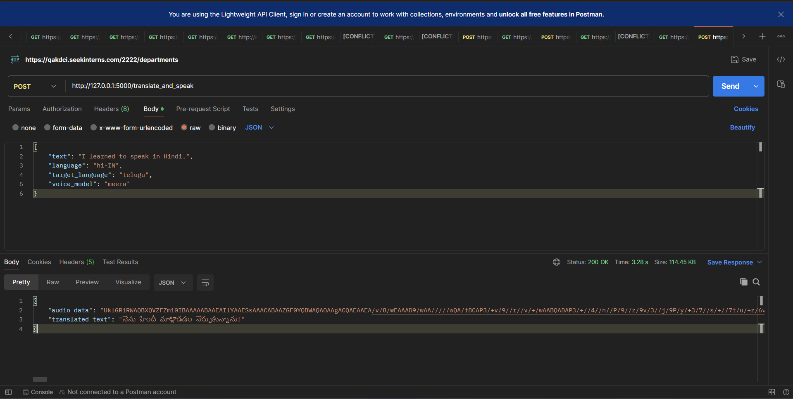

# Mobile Application for Real-Time Voice-to-Text and Text-to-Voice Translation

## Project Overview
This is a mobile application aimed at providing real-time voice-to-text and text-to-voice translation for Indian regional languages. The app is designed to assist individuals with hearing and speech impairments by offering both online and offline functionalities, ensuring accessibility in areas with poor connectivity.
## Problem

Imagine you're traveling to a remote tribal area, surrounded by people speaking a language entirely unfamiliar to you. You're trying to ask for directions or buy something from a local shop, but every attempt only leads to confusion. For many—whether travelers, locals, or individuals with hearing or speech impairments—these communication barriers can feel isolating and overwhelming.

## Solution

Our app,The Indian Nagish App, is here to change that. It's a mobile application that provides real-time voice-to-text and text-to-voice translations for multiple Indian regional languages. Whether you need to talk to someone face-to-face or just want to understand what's being said, our app makes it possible, even without an internet connection."

## WHY WE ARE DIFFERENT:-

Now, you might wonder, why not just use Google Translate? Here are a few key advantages of our app over it:
• Accuracy with Accents: Our app is specifically tailored to produce speech in an Indian accent which is possible with Sarvam AI API, which is easily understood by the Indian audience.
• Offline Functionality: Available for use without internet access.
• Error Correction: Unlike Google Translate, which often directly translates the input even if it is incorrect, our app corrects grammatical mistakes before translating, ensuring coherent outputs."

## Technologies Used

### Frontend

- **Design Software**: Figma
- **Framework**: Expo (React Native)
- **Programming Language**: JavaScript
- **Libraries/Tools**:
  - Google Speech-to-Text API
  - Google Text-to-Speech API
  - Sarvam AI API
  - Firebase for real-time database and authentication

### The FrontEnd Design



### Backend

- **Framework**: Python Flask
- **Programming Language**: Python
- **Machine Learning Libraries**:
  - TensorFlow Lite
  - PyTorch
  - Kaldi (for offline speech recognition)

## Backend Working

Our solution has two key phases, utilizing two powerful APIs: Gemini and Sarvamai.
• Phase 1: Speech to Text
The first phase starts with converting speech to text. This is where Gemini comes in—it detects the language, corrects grammatical mistakes, and then translates the corrected text into the target language. This ensures that the translated message is accurate and meaningful, unlike other services that may directly translate incorrect input.
• Phase 2: Text to Speech
In the second phase, we will use Sarvamai to convert the translated text back into speech. What sets Sarvamai apart is that it uses a special Indian accent for this conversion, making the output not only accurate but also naturally understandable for Indian users.

## Backend Testing



### APIs and Services

- **Google Speech-to-Text**: For converting speech input to text.
- **Google Text-to-Speech**: For converting text to audio output.
- **Firebase**: Provides real-time database services and user authentication.
- **ONNX**: For deploying machine learning models to run offline on mobile devices.

## Features

1. **Real-Time Translation**:
   - Converts spoken input into text and text into spoken output in real-time.
   - Supports multiple Indian languages and dialects.
2. **Offline Capabilities**:
   - Uses TensorFlow Lite and Kaldi to ensure the app works even without an internet connection.
3. **User-Friendly Interface**:
   - Designed to be intuitive for users of all age groups, especially focusing on accessibility features.
4. **Cross-Platform Integration**:
   - The app can be integrated with other popular communication apps, enabling users to send messages and communicate effectively.

## Installation

To set up and run this application, follow these steps:

### Prerequisites

- **Node.js** and **npm** for React Native.
- **Python 3.7+** for the backend.
- **Firebase Account** to manage the authentication and database.

### Frontend Setup (Expo)

1. Clone the repository.
   ```bash
   git clone <repository-url>
   cd <repository-directory>/frontend
   ```
2. Install the dependencies.
   ```bash
   npm install
   ```
3. Run the application.
   ```bash
   npx expo start
   ```

### Backend Setup (Python Flask)

1. Navigate to the backend directory.
   ```bash
   cd <repository-directory>/backend
   ```
2. Create a virtual environment.
   ```bash
   python3 -m venv venv
   source venv/bin/activate  # On Windows use `venv\Scripts\activate`
   ```
3. Install dependencies.
   ```bash
   pip install -r requirements.txt
   ```
4. Run the Flask server.
   ```bash
   python app.py
   ```

## Usage

1. Launch the mobile app on your device.
2. Select the language you wish to translate.
3. Either speak into the microphone or type text to get real-time translations.
4. The app will display the text or play audio in the selected language.

## Contributing

If you wish to contribute to this project, please fork the repository and submit a pull request. Make sure your contributions are well documented and tested.

## License

This project is licensed under the MIT License. See the LICENSE file for more details.

## Contact

For any queries, please contact [shaikmuhammadsami04@gmail.com].
